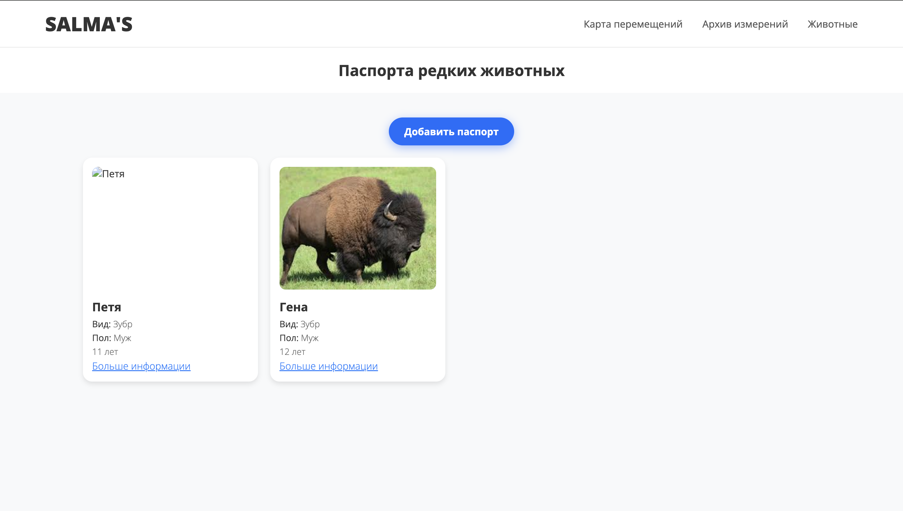

# SALMA's - модель детекции млекопитающих с фотоловушек


## Команда: 

- Маслов Андрей Анатольевич РИ-230916
- Лаврентьев Максим Петрович РИ-230917
- Утробин Владислав Александрович РИ-230934

## Артефакты
https://disk.yandex.com.am/d/dlzrkmDAnv0Gtw

## Проблема проекта

Учет популяции вымирающих видов животных требует от специалистов-зоологов огромных временных затрат. Ручная обработка данных с фотоловушек отнимает много времени. Это также повышает риск совершения ошибки и усложняет ведение отчетности.


## Цель проекта

Разработать WEB-сервис, который бы смог автоматизировать и ускорить работу зоологов.
Мы смогли бы фильтровать большие объемы данных с фотоловушек, точно определять вид запечатленной особи и успешно работать как с фотографиями, так и с видеофайлами.


## Работа с данными

Датасет был составлен из opensource данных (http://nature.kremlin.ru/animals). Мы выделили несколько видов животных с наиболее большим кол-вом данных. Взяли 50 фото и видео каждого выбранного типа. Затем для каждого из 14 классов:
- На найденных фото обучили собственный классификатор (в общем 14 классификаторов) - **animals_project/Other/Classifier_Training.py**
- Использовали эти классификаторы для кропинга видео и исключили дублирование кадров - **animals_project/Other/New_code_for_model2.py**
- Проверили на плохие фото (размытые, шумные, маленькие и тд), провели аугментацию и балансировку классов для того, чтобы выровнять классы - **animals_project/Other/Denoised_photo.py**; **animals_project/Other/Aggresive_augmentation.py**; **animals_project/Other/Photo_Quality_control.py**

Получили датасет на 8к фото и 14 классов. Он доступен на диске: https://disk.yandex.com.am/d/dlzrkmDAnv0Gtw


## Обучение моделей

Мы обучили модель ResNet50 на датасете.

**Данные по обучению лежат в папке models**

Метрики ResNet50 на тестовой выборке:


Также мы взяли готовую модель эмбеддингов для векторного представления фото и сравнения с другими фото.

## Создание Web-сервиса
Также мы создали Web-сервис на FastApi и React+Vite и обернули все в Docker. Используем базу данных PostgreSQL.

## Устройство сервиса


### Логика:

1) На вход подается фото/видео/zip
2) Файлы обрабатываются моделью ResNet50 и распознается вид животного
3) Сверяется является ли найденное животное редким
 - Если не редкое - сохранение в архив данных
 - Если редкое - сжатие изображение в векторное представление с помощью модели эмбеддингов и сравнение с уже сохраненными эмбеддингами для соотношения особей.
4) Вывод результатов обработки

### Результат

Главное меню:


Страница результата обработки:


Страница паспортов:


Конкретный пасспорт:


Карта перемещений:


Архив загрузок:


## Запуск сервиса

Для запуска сервиса выполните команды поочереди:
1)
```
git clone https://github.com/AdneryMaslov/animals_project.git
```
2)
```
cd animals_project/fullstack
```
3)
```
docker-compose up --build
```
**Готово!**

## Выводы
Мы разработали полноценный веб-сервис для детекции млекопитающих по фото и видео с фотоловушек. 
Использовали модель ResNet-50 и достигли высокой точности — 0.9. 
Наша система автоматизирует работу зоологов, ускоряя анализ данных и снижая вероятность ошибок.
Реализовали сравнение embedding’ов, позволяющий отслеживать конкретных особей и вести учет популяции редких видов.
Решение масштабируемо и может быть адаптировано под другие задачи мониторинга дикой природы.

